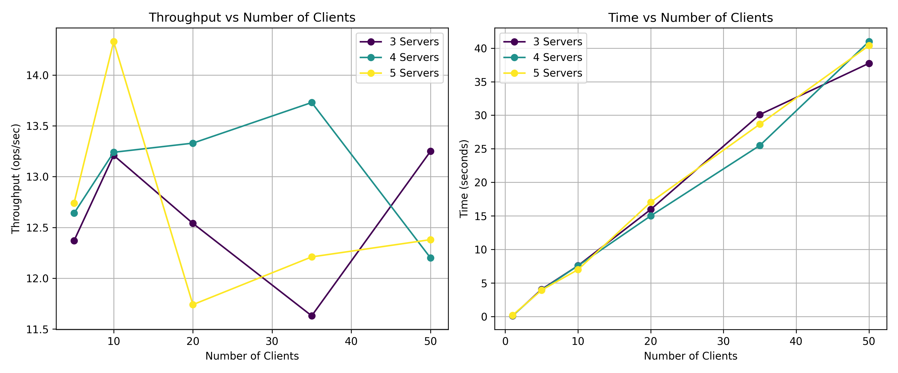

# Distributed Lock Manager

A distributed lock manager implementation with consensus-based replication and leader election.

## Project Overview

This project implements a distributed lock management system that provides coordinated access to shared files across multiple clients. The system employs a leader-based consensus approach to maintain consistency while tolerating server failures.

### Features

- Distributed lock acquisition and release
- Append operations to files with mutual exclusion
- Leader election with fault tolerance
- Replicated operation log
- Automatic failover when leaders crash
- Exactly-once semantics for file operations
<!-- - Client redirection to current leader -->

## Installation

1. Install required tools
```bash
go install google.golang.org/protobuf/cmd/protoc-gen-go@latest
go install google.golang.org/grpc/cmd/protoc-gen-go-grpc@latest
```

2. Initialise GO modules
```bash
go mod init lock-service
```

3. Generate the code from proto
```bash
protoc --go_out=. --go-grpc_out=. proto/lock.proto
```

4. Tidy up dependencies
```bash
go mod tidy
```

## Project Structure

### Protocol Definition
- `proto/lock.proto` - Protocol Buffer definition for the RPC service, including message types and service interfaces.
- `lock/lock_grpc.pb.go` and `lock/lock.pb.go` - Generated gRPC code from the protocol definition.

### Server Components
- `server/server.go` - Main server implementation that handles client requests for locks and file operations. Manages lock acquisition, release, and file operations. Includes state persistence, lock timeout management, and server initialization.
- `server/consensus.go` - Implements the consensus algorithm for replicating operations across servers. Handles operation log replication and rollback through leader-follower communication and ensures operations are consistent across the cluster.
- `server/election.go` - Implements leader election using a Raft-like protocol. Manages server state transitions (follower, candidate, leader), voting mechanisms, and heartbeat messaging.

### Client Components
- `client/client_library/client_library.go` - Core client library that provides APIs for connecting to the lock service, acquiring/releasing locks, and file operations.
- `client/client.go` - Sample client implementation that connects to the server and performs lock/unlock operations in cycles.
- `client/clientA.go` and `client/clientB.go` - Test client implementations for single server system.
- `client/client.go` - Interactive CLI client for manual testing of the lock service.

## Usage

### Starting the Servers

Start the leader server (ID 0):
```bash
go run server/*.go -create-files=true -id=0 -port=50051
```

Start follower servers:
```bash
go run server/*.go -id=1 -port=50052
go run server/*.go -id=2 -port=50053
go run server/*.go -id=3 -port=50054
go run server/*.go -id=4 -port=50055
```

To restart a crashed server and recover its state:
```bash
go run server/*.go -id=X-1 -port=5005X -load-state=true
```

Command-line arguments:
- `-create-files=true`: Create the data files (only needed for first server startup)
- `-load-state=true`: Load server state from disk (for recovery)
- `-id=X`: Set server ID (0-4)
- `-port=XXXX`: Set server port

### Running Clients

Run a sample client:
```bash
go run client/<client>.go
```

## Architecture

### Consensus Protocol
The system uses a leader-based consensus protocol inspired by Raft:
- Leader election with randomized timeouts
- Term-based voting system
- Replicated operation tracking
- Heartbeat mechanism for leader liveness

### Lock Management
- Single global lock with FIFO queue for waiters
- Timeout mechanism to prevent indefinite lock holding
- Exactly-once semantics using sequence numbers

### Fault Tolerance
- The system can tolerate failures of a minority of servers
- Automatic leader election when the current leader fails
- State persistence for crash recovery

## Performance

We conducted performance testing to evaluate the system's throughput characteristics under different configurations. The testing methodology involved:

1. Varying the number of concurrent clients (5-50)
2. Testing with different server cluster sizes (3, 4, and 5 servers)
3. Each client performing a complete operation cycle: lock acquisition, file append, and lock release
4. Measuring throughput in operations per second

The results show how throughput varies with increasing client load and different server configurations:



**Average Throughput (ops/sec) by Server Count:**
- 3 servers: 27.68
- 4 servers: 24.93
- 5 servers: 19.66

**Overall average throughput:** 24.09


We also conducted a specialized performance test focusing solely on append operations. This test isolates the file append performance by:

1. Acquiring the lock once per client
2. Performing multiple append operations (100) while holding the lock
3. Measuring only the time spent on append operations, excluding lock acquisition/release overhead

| Active Nodes | Total Append Time | Average Time per Append | Append Throughput |
|:------------:|:-----------------:|:-----------------------:|:-----------------:|
| 5 nodes      | 398.97 ms         | 3.98 ms                 | 250.64 ops/sec    |
| 4 nodes      | 450.59 ms         | 4.50 ms                 | 221.93 ops/sec    |
| 3 nodes      | 515.12 ms         | 5.15 ms                 | 194.13 ops/sec    |

These results highlight that the actual file operations are quite efficient (194-250 ops/sec), with most of the overhead in the complete lock-acquire-append-release cycle coming from lock management operations.

